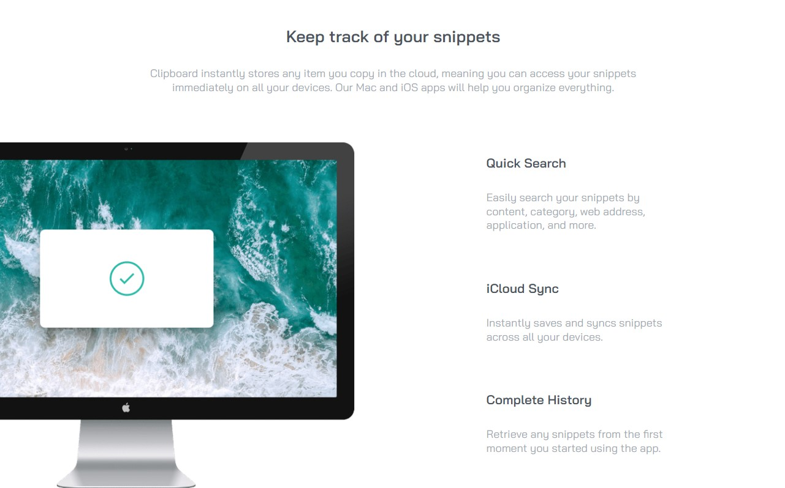

# Clipboard landing page solution

This project was build as a part of frontend classes conducted within the Information Technology Club [LearnIT](learnit.how) :)

### The challenge

The challenge is to provide a solution for the [Clipboard landing page challenge on Frontend Mentor](https://www.frontendmentor.io/challenges/clipboard-landing-page-5cc9bccd6c4c91111378ecb9).

Users should be able to:

- View the optimal layout for the site depending on their device's screen size
- See hover states for all interactive elements on the page

### Links

- Live Site URL: [Github Pages](https://asenataluczak.github.io/clipboard-landing-page-master/)

### Screenshot

### Used concepts

- Semantic HTML5 markup
- Flexbox
- Mobile-first workflow
- BEM - CSS Name Convention

### Useful resources

- [A Complete Guide to Flexbox](https://css-tricks.com/snippets/css/a-guide-to-flexbox/)
- [Position - MDN Web Docs](https://developer.mozilla.org/en-US/docs/Web/CSS/position)
- [Learn CSS Position In 9 Minutes - Web Dev Simplified YT](https://www.youtube.com/watch?v=jx5jmI0UlXUposition)
- [A Complete Guide to CSS Media Queries](https://css-tricks.com/a-complete-guide-to-css-media-queries/)
- [BEM Naming](http://getbem.com/naming/)
